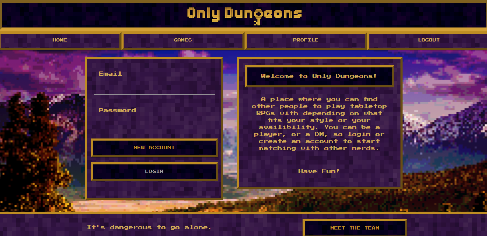
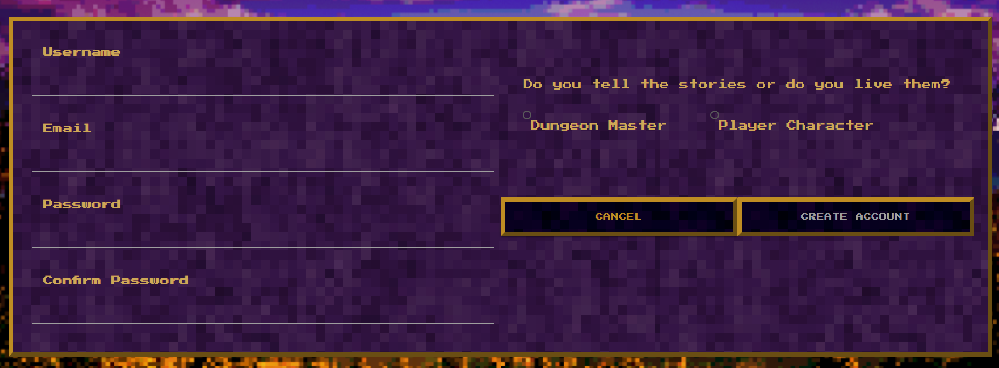
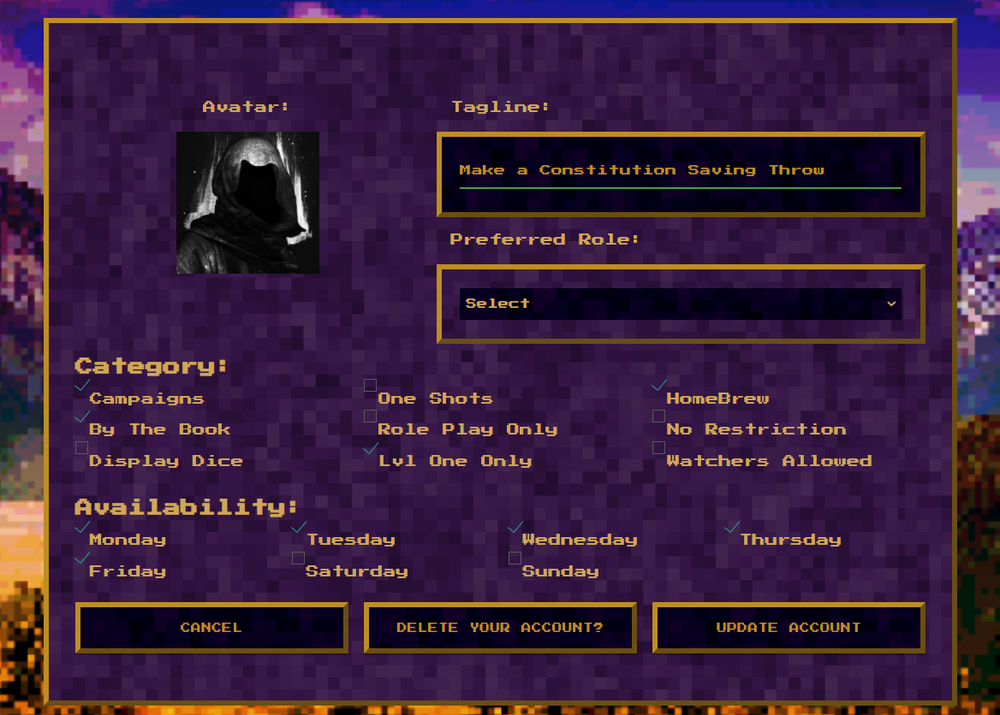
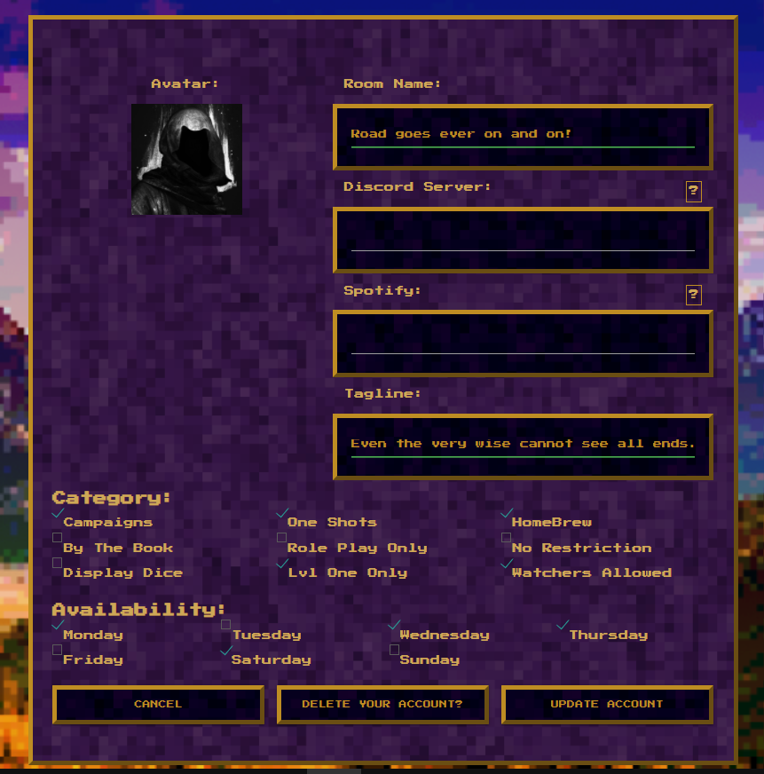
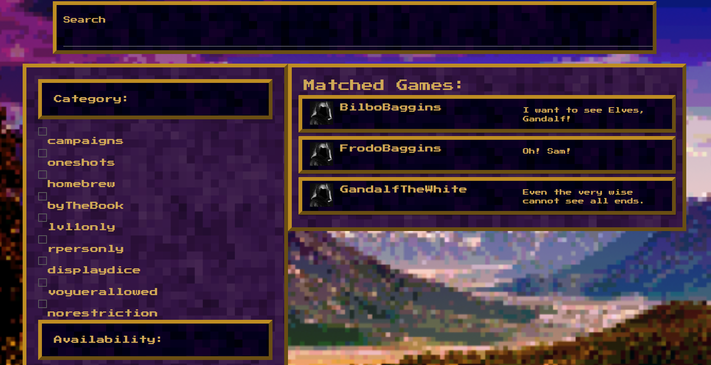
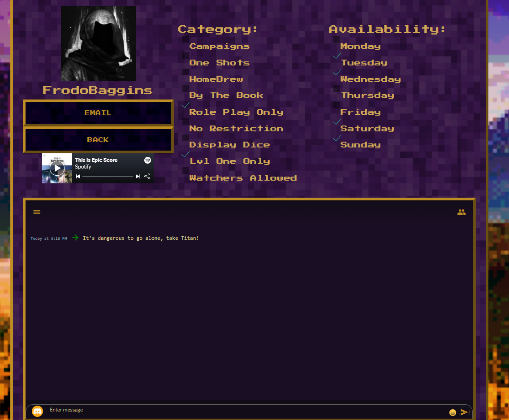
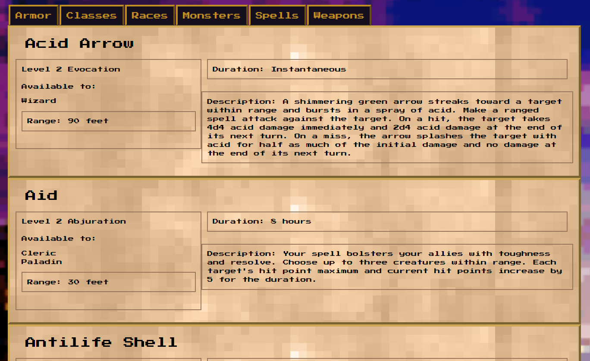
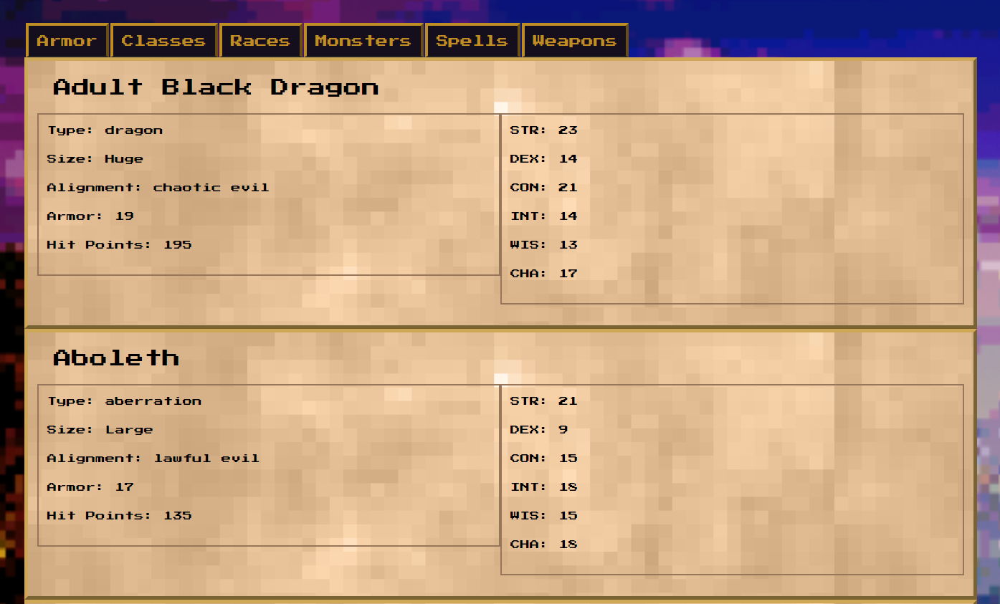

# Only Dungeons

  <hr>

[](https://opensource.org/licenses/MIT)


  <br/>

  <br/>

## Table of Contents

~[Installation](#installation)<!-- ~[Usage](#usage) -->
~[Contributions](#contributing)
~[Features](#features)
~[License](#license)
~[Questions](#questions)

  <br/>

## Installation

  <hr>
  
  **To edit/use the application, please follow the steps to pull the repository from GitHub through Git Bash and pull the script into VSCode, provided all three items are already installed on a local network.  It also requires Node.JS to be installed on the local network**

Instillation steps are as follows:

1. Access the repository at [Git Hub] https://github.com/SamiSully/OnlyDungeons2.
2. Click on the code section (in green) and copy the SSH key.
3. Once the SSH key is copied, open the terminal through Git Bash.
4. Find or create the folder the user wants to work in and enter the following commands the the Git terminal:

   1. Clone the repoistory :

   ```
   git clone [copied link]
   ```

   (_this will allow access the repository to the local computer._)

   2. Open the reposity in VS code from git:

   ```
   code .
   ```

   (_This will extract the code and link the paths to VSCode for review/editing/uploading_)

   3. Install the modules and packages

   ```
   npm install
   ```

   (_In the the terminal, please run "npm install" (as the dependencie should be there) to download the modules necessary for this project to work._)

   4. Connect the local database with MongoDB (user must have this set up as it is not provided)

   ```

   ```

   5. Start the application

   ```
   npm start
   ```

   (_Once the modules are downloaded and the database is connected, please open up the terminal again and run "npm start"._)

<br/>

### Deployed Application

<hr/>
Please click on the link below to be redirected to the live application:

1. https://onlydungeons.herokuapp.com/

  <br/>

<!-- ## Usage

  <hr>

  <br/>

To be filled

<br/> -->

## Contributions

  <hr>
  
  ### Contributors 
  
We would like to express our gratitues to our GA Tech/Trilogy Instructor and TA's as well as GA Tech/Trilogy's tutors: Erik Hoverston, Justin Ryes, Andrew Styles and Miguel Chavez for their advice and knowledge.    
  
  <br/>
  
  ## Features
  <hr>
<br/>

 # Welcome to the Only Dungeons!

<br/>

### With a host of features, we would love the user to come and play

<br/>

### | A new user will be able to creat a new account or login with the application



<br/>

### | A new user can chose to be either a Dungeon Master or a Player Character

#### \***\*Each role is unique\*\***



### | Player Characters:

#### 1) Player Characters can add a tag line for their profile as well as select a role of their choice.

#### 2) Player Characters can also choose which category that suites their play style as well as when they are avialable to play.



### | Dungeon Masters :

#### 1) Dungeon Masters can add the room name and tag line for their profile.

#### 2) Dungeon Masters can also add their custom Spotify list as well as add their custom discord server.

#### 3) Dungeon Masters can also choose which category that suites their play style as well as when they are avialable to play.



### | When a user is looking for the Dungeon Master that fits and is similar to their desires, the user will be able to filter and search through a mariade of Dungeon Masters.



### | Once the Dungeon Master's rooms are customized to the user's liking, they will be able to interact with their custom Spotify playlist as well as able to have their server set up through Discord for live active chat.



   <br/>

### | Users will also have access to information of the game, including spells, monsters, races, weapons, armor and classes

<br/>

##### | Spells 


   <br/>

##### | Monsters


   <br/>


## Built With:

<hr/>

- [HTML](https://developer.mozilla.org/en-US/docs/Web/HTML)
- [CSS](https://developer.mozilla.org/en-US/docs/Web/CSS)
- [Materialize](https://getbootstrap.com/)
- [Javascript](https://materializecss.com/)
- [Node.js](https://nodejs.org/en/)
- [Express](https://www.npmjs.com/package/express)
- [MongoDB](https://www.mongodb.com/)

## License

  <hr>

This application is licensed under MIT

  <br/>

## Questions

  <hr>
  
  #### If you would like to know more, please contact or see any other projects of the Team below:

- [Jonathan Canales](https://github.com/modern-sapien)
- [Alex Fleming](https://github.com/ad-fleming)
- [Sami Sully](https://github.com/SamiSully)
- [Brandon Walker](https://github.com/BrandonWalker88)
- [Nathan Calle](https://github.com/Napica)
